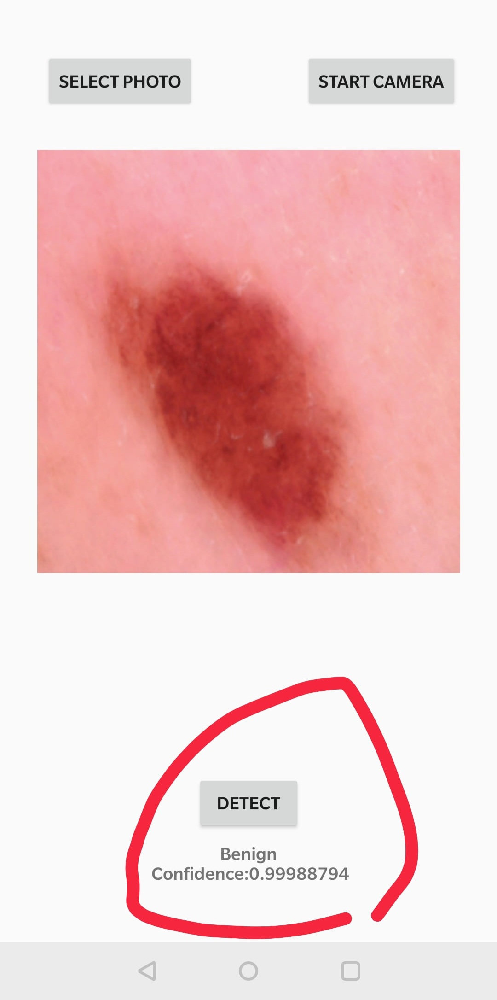
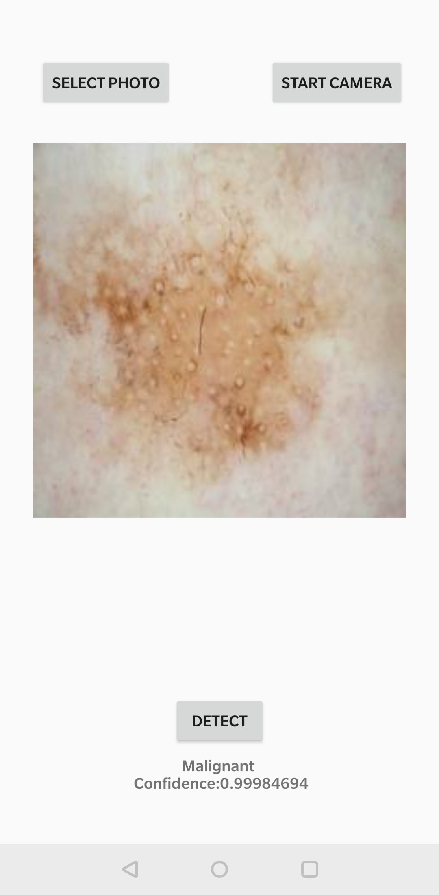
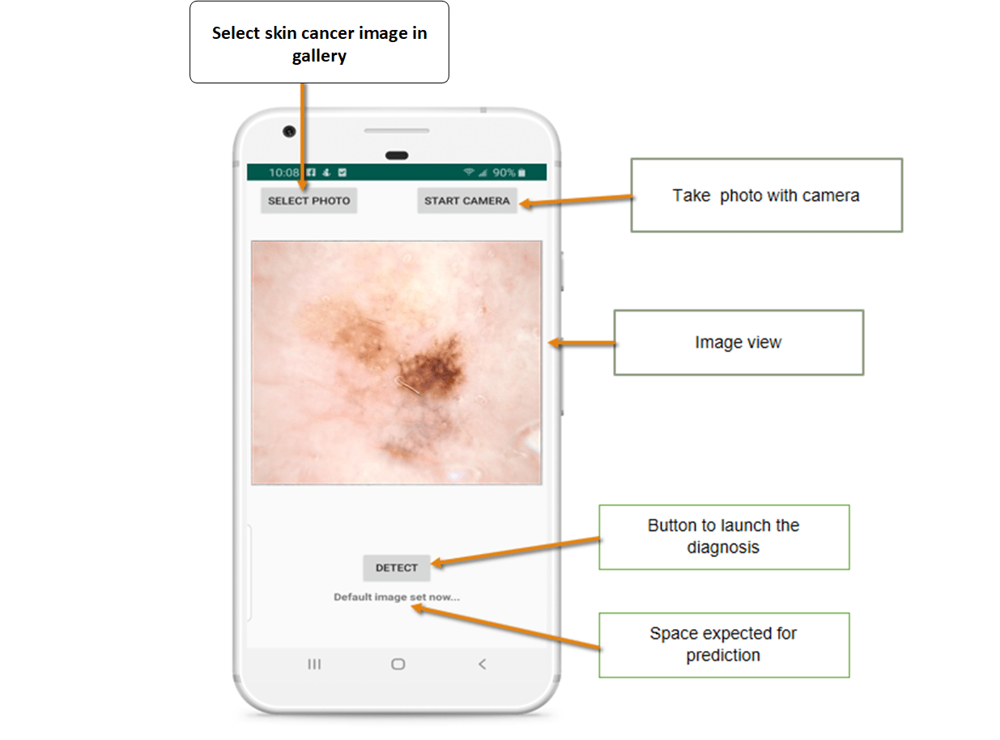

# SMARTOnco
AI Enabled Android App for Detecting Skin Cancer, by Dr. Yuvraj Kumar (Ph.D - Artificial Intelligence)

In recent days, skin cancer is seen as one of the most Hazardous form of Cancers found in Humans. Skin cancer is found in various types such as Melanoma, Basal and Squamous cell Carcinoma among which Melanoma is the most unpredictable. The detection of Melanoma cancer in the early stage can be helpful to cure it. Computer vision can play important role in Medical Image Diagnosis and it has been proved by many existing systems.

# About the Project

The project is mainly divided into two parts:

> TensorFlow and Keras are used to build and create a machine learning model.
> TFLite is used to deploy the model to an Android application.

Using Convolutional Neural Networks (CNN), algorithm development and model training has been done to distinguish between benign and malignant skin cancers. 

## Loading the dataset

You can use your own custom dataset. I have used the skin cancer dataset for binary classification of benign vs malignant cancer types, once done, annotation (labelling) needs to be performed. 

## Transfer Learning with TensorFlow hub:

Select the Hub/TF2 module to use, you can choose inception v3 or Mobile net. In this module, MobileNet model has been used. 

## Data Preprocessing:

Kindly Set up data generators to read images from source folders, transform them to float32 tensors, and feed them to the network (along with their labels). NOTE: data that is fed into neural networks is normally normalised in some way to make it easier for the network to process.

For this project, data has been preprocessed including images by converting the pixel values to [0, 1] range (all values are in the [0, 255] range). NOTE: The input data must be scaled to 224×224 pixels as an input, as specified by the networks. You can choose whether or not to use image AUGMENTATION option.

## Building the model:

It’s as simple as using the Hub module to layer a linear classifier on top of the feature extractor. You may start with a non-trainable feature extractor for speed, but you may enable fine-tuning for more accuracy, although training the model generally takes long time which may be further be reduced if the computing infrastructure is advanced as compared to normal GPU. 

## Training the Model:

Each step has to be validated by training the model with the validation dataset. I have been able to achieve close to 98% accuracy after 21 epochs, but fine-tuning can increase this to achieve 99.99% Accuracy. 

# Files

Download all the files in a folder. Install Winrar and unzip the files to view master folder.

# AI Model

Model is already trained using CNN. The model and the ipynb code is in Training folder.

# Android App

I am not an Android Developer. The app could be buggy or may not work at all. If you want to work on this app, you may import the project, look at the code to understand it better, and further look at the AI integration on how it is done.

TFLite has been used to build this end-to-end Android application.

### Adding TFLite model to the Android Project

First — load the model in the Android project, model.tflite (not included in this repo upload) and labels.txt into assets/ directory. The file model.tflite is the result of the model training done using jupyter notebook (anaconda 3). Add TFLite dependency to app/build.gradle file.

# Sample images used for Model Training

Benign - 30 Images

Malignant - 27 Images 

## Proof of Concept 

### Benign - 99% confidence 

### Malignant - 99% confidence

### App UI Sample

## Suggestions and inputs (if any) 

Any suggestions or cowork opportunity is welcome to enhance the application. 
